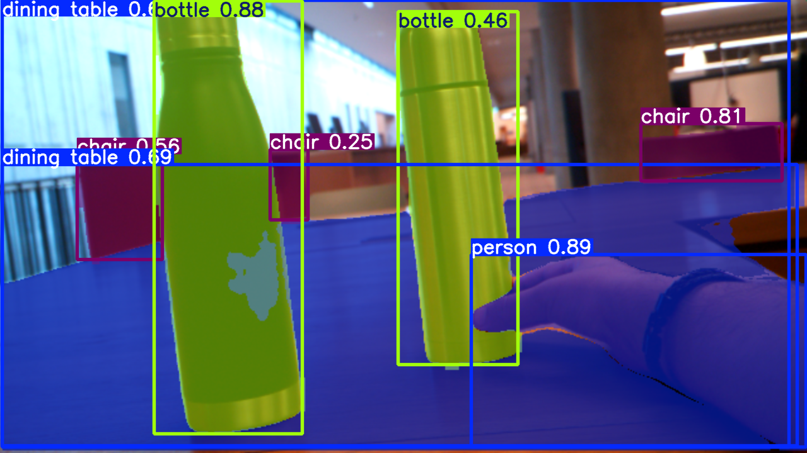

# Interactive Segmentation and Hand Gesture Editor

This project is an interactive Python application that leverages state-of-the-art object detection and segmentation with the YOLO (You Only Look Once) model combined with hand gesture recognition via MediaPipe. It allows real-time video capture from a webcam where users can:

   - Draw and manipulate various shapes (rectangles, circles, ellipses) directly on the video feed to label objects manually.

   - Detect objects and generate segmentation masks in real-time using a YOLOv11 segmentation model.

   - Overlay detected object masks on the video feed with customizable colors to highlight the selected regions.

   - Use hand gestures (tracked through MediaPipe Hands) to interact with the segmented objects, enabling intuitive object selection, dragging, and release based on thumb and index fingertip positions.

   - Manage multiple labeled objects with capabilities to add, resize, and delete bounding shapes via mouse or move objects via hand interaction.

## Solution Approach

This application is built around YOLOv11's real-time instance segmentation. When the user labels an area on the video feed, the system automatically extracts and overlays segmentation masks for objects within that region. This makes the interaction fast, intuitive, and responsive.



## Key Technologies Used:

   - YOLOv11 (Ultralytics): Real-time object detection and segmentation.

   - MediaPipe Hands: Hand landmark detection for gesture recognition.

   - OpenCV: Video capture, image processing, and GUI interaction.

   - NumPy: Numerical computations and geometric calculations.

## Features

- Real-time object detection and segmentation using Ultralytics YOLOv11.
- Interactive drawing of bounding shapes (rectangles, circles, ellipses) over video feed.
- Supports shape manipulation: move, resize, delete.
- Hand gesture detection with MediaPipe for enhanced interaction.
- Overlay of segmentation masks with customizable colors.
- Capture and drag segmented objects with intuitive controls.


---

##  Demo
 

---


### File Descriptions

- **`webcam_view.py`**: Basic script to preview webcam feed.
- **`edit_mode.py`**: Interactive editor to draw, resize, and delete shapes manually.
- **`APP_launch.py`**: Full app combining both editing and interaction modes (drag/drop with hand gestures).

---


## Hand Gestures Used

- **Pointing**: Index finger extended to highlight or hover over an object.
- **Pinch (Thumb + Index)**: Used to grab and move a highlighted object.
- You don’t need to touch the object directly just aim and pinch in the air!

---

##  Installation Guide (Ubuntu & Windows)

### 0.Clone the repository

```bash
git clone https://github.com/TXWISSRX/Technical_challenge.git
```

### 1. Install Python 3

Make sure Python 3.8+ is installed:

```bash
python3 --version
```

2. Create a Virtual Environment

Ubuntu/Linux:

```bash
python3 -m venv venv
source venv/bin/activate
```
Windows (CMD):

```bash
python -m venv venv
venv\Scripts\activate
```

3. Install Required Dependencies

```bash
pip install -r requirements.txt
```
### How to Use

After setting up the environment:

Preview the camera feed

```bash
python3 webcam_view.py
```
Try the Edit Mode (drawing shapes, resizing, deleting)

```bash
python3 edit_mode.py
```
**FULL APP:**
Run the Full Interactive Application (Edit + Interact mode)
```bash
python3 APP_launch.py
```
## ⌨️ Keyboard Shortcuts & Usage Tips
- **`R`** → Set drawing tool to **Rectangle**
- **`C`** → Set drawing tool to **Circle**
- **`E`** → Set drawing tool to **Ellipse**
- **`Q`** → Quit the application
- **`Esc`** → Clear all label shapes from the screen
---

### 🖱️ Mouse/Touch Interaction

- **Click and Drag** inside a shape to move it  
- **Click on a corner** of a shape to resize it  
- **Right-click** on a shape to delete it

---
**Note:** If you're using an external USB camera, you may need to change cv2.VideoCapture(0) to cv2.VideoCapture(1) in the code.

---
### AI in Use

This application leverages:

**MediaPipe Hands:**
A machine learning model provided by Google that detects 21 3D hand landmarks in real time.

**YOLOv11 Segmentation:**
Provides real-time instance segmentation masks that respond instantly to user-labeled areas.


## Hand Gestures Used

- ☝️ **Pointing** (Index Finger): Used to target an object
- 🤏 **Pinch** (Thumb + Index): Used to grab and move a highlighted object

---

##  Future Enhancements
- Object rotation via two-finger gesture


---

##  Author
**Wissem Malleh**  
[GitHub Profile](https://github.com/TXWISSRX)


